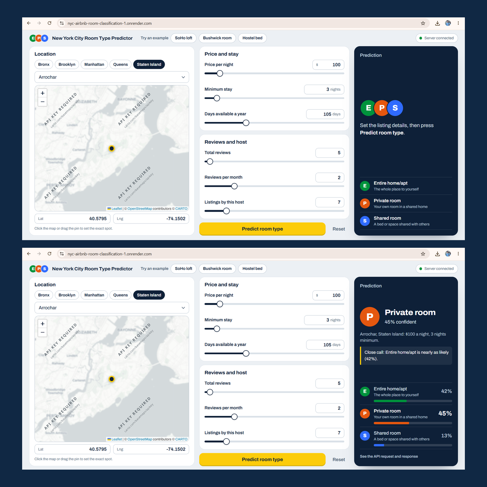
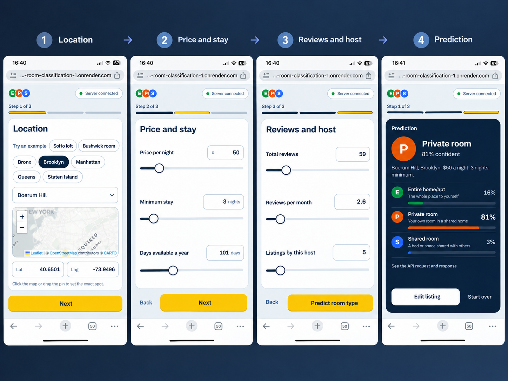

# 🏠 New York City Airbnb Room Type Predictor

An end-to-end Machine Learning web application that predicts the **room type of an Airbnb listing in New York City** based on listing, location, pricing, review, and availability features.

The project covers the complete workflow from **data analysis and model development to API deployment and an interactive web interface**.

### 🔗 Live Demo
**[Try the New York City Airbnb Room Type Predictor](https://nyc-airbnb-room-classification-1.onrender.com)**

### 📖 API Documentation
**[FastAPI Swagger Docs](https://nyc-airbnb-room-classification-1.onrender.com/docs)**


## 📸 Preview

### Desktop


### Mobile
  


## 📌 Overview
The application treats room-type prediction as a **multiclass classification problem**.

It predicts one of three Airbnb room types:

* **Entire home/apt**
* **Private room**
* **Shared room**

The trained Machine Learning pipeline is served through **FastAPI** and deployed on **Render**, while the frontend provides a simple interface for users to make predictions without writing code.

---

## 📊 Dataset

The project uses the **New York City Airbnb Open Data (2019)** dataset from Kaggle.

**Source:** [New York City Airbnb Open Data On Kaggle](https://www.kaggle.com/datasets/dgomonov/new-york-city-airbnb-open-data)

* **48,895 listings**
* **16 original features**
* Target variable: `room_type`
* Dataset downloaded programmatically using **KaggleHub**

The main features used for prediction include:

`latitude`, `longitude`, `price`, `minimum_nights`, `number_of_reviews`, `reviews_per_month`, `calculated_host_listings_count`, `availability_365`, `neighbourhood_group`, and `neighbourhood`.

The target classes are imbalanced, with **Shared room representing a small portion of the dataset**. Therefore, **macro F1** was considered alongside accuracy during model evaluation.

---

## 🤖 Machine Learning

The notebook contains the complete model development workflow:

**EDA → Data Cleaning → Feature Engineering → Preprocessing → Model Comparison → Hyperparameter Tuning → Evaluation → Model Export**

### Preprocessing

A Scikit-learn `ColumnTransformer` and `Pipeline` were used to keep preprocessing consistent between training and prediction.

* Numerical features → median imputation + standard scaling
* Categorical features → most-frequent imputation + one-hot encoding
* Extreme values in `price` and `minimum_nights` were capped at the 99th percentile
* The dataset was split using stratified train/test sampling

### Model Comparison

Four classification models were evaluated using cross-validation:

| Model               |  Accuracy |  Macro F1 |
| ------------------- | --------: | --------: |
| Logistic Regression |     0.659 |     0.522 |
| Decision Tree       |     0.782 |     0.647 |
| Random Forest       | **0.851** | **0.715** |
| Gradient Boosting   |     0.850 |     0.705 |

Random Forest was then further tuned using `RandomizedSearchCV` with **macro F1** as the optimization metric.

### Final Performance

| Metric       | Test Score |
| ------------ | ---------: |
| **Accuracy** |  **85.6%** |
| **Macro F1** |  **0.743** |

The final evaluation is based on the held-out test set.

Because the classes are imbalanced, **macro F1 is reported alongside accuracy** to provide a more informative view of performance across all room types.

---

## 🚀 Deployment

The trained pipeline is serialized with **Joblib** and integrated into a FastAPI application.

The application is deployed on **Render** and provides:

* Interactive room-type prediction
* Input validation with Pydantic
* REST API endpoint
* Swagger API documentation
* Browser-based frontend
* Prediction probabilities for the three room types

### Live Application

**[Open the Predictor →](https://nyc-airbnb-room-classification-1.onrender.com)**

---

## 🗂️ Project Structure

```text
nyc-airbnb-room-classification/
│
├── app/
│   ├── __init__.py
│   ├── main.py
│   └── schemas.py
│
├── models/
│   └── nyc_airbnb_room_classification_model.pkl
│
├── notebooks/
│   └── nyc_airbnb_room_classification.ipynb
│
├── frontend/
│   ├── index.html
│   ├── style.css
│   └── script.js
│
├── docs/
│   ├── desktop-preview.png
│   └── mobile-preview.png
│
├── requirements.txt
├── README.md
└── .gitignore
```

---

## 🛠️ Tech Stack

| Category    | Technologies                        |
| ----------- | ----------------------------------- |
| Language    | Python                              |
| Data & ML   | Pandas, NumPy, Scikit-learn, Joblib |
| API         | FastAPI, Pydantic, Uvicorn          |
| Frontend    | HTML, CSS, JavaScript, Leaflet      |
| Data Source | Kaggle, KaggleHub                   |
| Development | Jupyter Notebook                    |
| Deployment  | Render                              |

---

## 💻 Run Locally

```bash
git clone https://github.com/jahidhasan-cse/nyc-airbnb-room-classification.git
cd nyc-airbnb-room-classification
pip install -r requirements.txt
py -m uvicorn app.main:app --reload
```

Then open:

`http://127.0.0.1:8000`

API documentation:

`http://127.0.0.1:8000/docs`

---

## 🎯 Key Highlights

* End-to-end Machine Learning project
* Multiclass classification with imbalanced data
* Scikit-learn `Pipeline` and `ColumnTransformer`
* Model comparison with cross-validation
* Hyperparameter tuning with `RandomizedSearchCV`
* Model serialization using Joblib
* FastAPI REST API
* Interactive frontend with Leaflet map
* Swagger API documentation
* Cloud deployment with Render

---

## 🔮 Future Improvements

* Improve performance on the minority **Shared room** class
* Add automated API testing
* Add CI/CD for automated deployment
* Add model monitoring and periodic retraining
* Experiment with additional classification techniques

---


## 👨‍💻 Author

**Md. Jahid Hasan**  
BSc in Computer Science & Engineering  
Daffodil International University  
**GitHub:** [@jahidhasan-cse](https://github.com/jahidhasan-cse)

---

## 📄 License & Dataset Attribution

This project was developed with reference to publicly available tutorials and documentation, and was further customized for this implementation.

The dataset used in this project is **New York City Airbnb Open Data (2019)**, obtained from Kaggle:
**[New York City Airbnb Open Data On Kaggle](https://www.kaggle.com/datasets/dgomonov/new-york-city-airbnb-open-data)**

This project is intended for **educational and portfolio purposes**.
